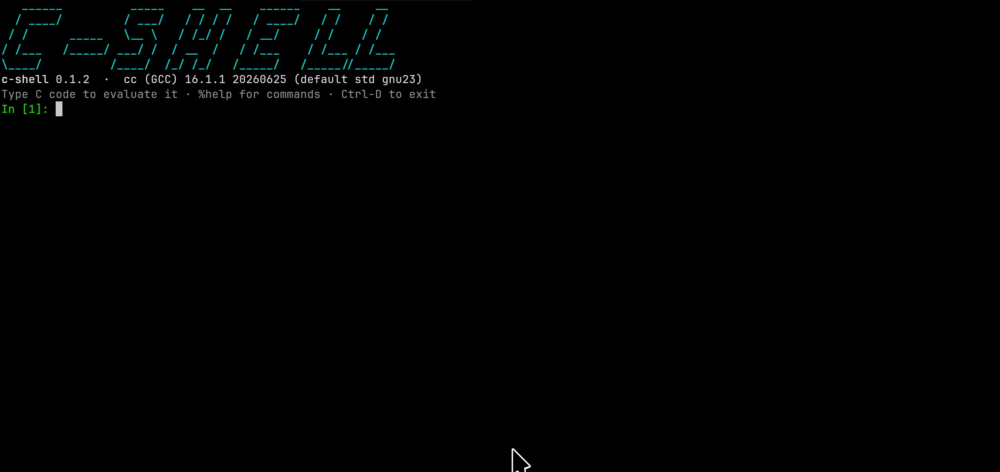

<h1 align="center">c-shell</h1>

<p align="center">
  <strong>A compiler-backed interactive shell for C.</strong>
  <br>
  Explore syntax, types, diagnostics, and implementation behavior without writing a temporary <code>main</code>.
</p>

<p align="center">
  <a href="https://crates.io/crates/c-shell"></a>
  <a href="https://github.com/ChenZhongPu/C-Shell/actions/workflows/ci.yml"></a>
  <a href="https://www.rust-lang.org/"></a>
  <a href="https://github.com/ChenZhongPu/C-Shell/releases"></a>
  <a href="LICENSE"></a>
</p>

<p align="center">
  <a href="#try-it">Try it</a>
  ·
  <a href="#installation">Installation</a>
  ·
  <a href="#usage">Usage</a>
  ·
  <a href="#commands">Commands</a>
  ·
  <a href="#how-it-works">How it works</a>
  ·
  <a href="#known-limitations">Limitations</a>
</p>

<p align="center">
  
</p>

## Try it

Start `c-shell` and type C directly at the prompt:

```text
c-shell 0.2.5  ·  cc (GCC) 16.1.1 (default std gnu23)
In [1]: int x = 41;
In [2]: x + 1
Out[2]: 42
In [3]: 3 / 2
Out[3]: 1
In [4]: 3.0 / 2
Out[4]: 1.5
In [5]: -1 > 0u
<input>:1:4: warning: comparison of integer expressions of different signedness
    1 | -1 > 0u
      |    ^
Out[5]: 1
```

## Highlights

- **Your compiler, your answers.** GCC, Clang, MSVC, and tcc determine the
  language rules, ABI behavior, warnings, and errors.
- **A stateful C session.** Declarations, statements, functions, and types
  remain available to later inputs without replacing C's normal scope rules.
- **Interactive editing.** Syntax highlighting, completion, history, smart
  continuation indentation, closing-brace dedent, and editable prior inputs
  make multi-line C comfortable at a terminal.
- **Useful values, not just exit codes.** Scalar values, strings, arrays, and
  supported structs are printed automatically; `%type` inspects expressions
  without evaluating them.
- **Interactive or scriptable.** Use the REPL, `-e`, script files, or piped
  input with deterministic exit status and diagnostics.
- **Cross-platform compiler drivers.** GNU-style and MSVC-style command lines
  are detected by capability probes rather than executable names.

## Why a real compiler?

c-shell assembles your input into a complete C program and hands it to the
**real compiler on your machine**. That is deliberate: integer promotions,
implementation-defined details, ABI choices and compiler diagnostics are most
useful when they come from the toolchain you actually use. An interpreter's
answer speaks only for the interpreter.

A result is still an observation of one compiler invocation, not a guarantee
from the C standard. In particular, undefined or unspecified behavior may
change with compiler version, flags, surrounding code or another execution.

## Installation

Requires a Rust toolchain to build and, at runtime, a C compiler compatible
with one of the supported GNU/Clang or MSVC command-line dialects. GCC, Clang,
MSVC and tcc are the built-in detection candidates.

Install the published crate from crates.io:

```sh
cargo install c-shell
```

Or install directly from a source checkout:

```sh
cargo install --path .
```

With `--cc`, only that compiler is tried. Otherwise startup checks `$CC`, then
PATH (`cc`, `gcc`, `clang`, `tcc`; on Windows `gcc`, `clang`, `cc`,
`clang-cl`, `cl`). `--cc` and `$CC` must name one executable or path, not a
shell command containing flags. The first candidate that passes every check
wins. Capabilities are probed by trial compilation, never derived from version
strings — executable names can be aliases, and distros backport features. For
example, Apple Command Line Tools may provide `/usr/bin/gcc` as an Apple Clang
driver, while GNU GCC installed separately through Homebrew or MacPorts is
genuine GCC.

```sh
c-shell                              # auto-detect a compiler
c-shell --cc clang --std c23         # request compiler and mode; verify the banner
c-shell --timeout 30                 # deadline for each compilation and program run
c-shell -e 'sizeof(long)'            # evaluate and exit: bare value on stdout,
                                     # diagnostics on stderr, exit code on failure
c-shell --script demo.csh            # run inputs from a file, then exit
c-shell --quiet                      # interactive, but skip the banner
echo '1 + 1' | c-shell               # piped input: transcript output, no banner
```

Terminal handling is automatic: when stdout is not a terminal (or
`TERM=dumb`, or `NO_COLOR` is set) colors are off; when stdin is not a
terminal the banner, prompts and farewell are suppressed and input is read
in batch mode — which also accumulates multi-line definitions, so scripts
and pipes can contain full function bodies.

The language standard defaults to **whatever your compiler defaults to**
(gnu23 for gcc 16, gnu17 for clang 22; the banner shows what was detected).
This matches the compiler's language mode, not its entire command line:
c-shell also adds diagnostics, output and platform link flags plus generated
REPL scaffolding.
Select a supported mode with `--std c17`, or switch mid-session with `%std
c17` / `%std default`. One exception: when the compiler's default mode cannot
compile `_Generic` (MSVC without `/std:` is the common case), c-shell tries
c17 and then c11, and the banner reports an automatic raise. `_Generic`
support is the actual capability floor: a candidate that cannot compile a
representative value-printer probe in the selected mode is skipped. An
unsupported explicit `--std` is an error both at startup and in `%std`.

## Usage

| Input                  | Behavior                                      |
| ---------------------- | --------------------------------------------- |
| `x + 1`                | evaluated, value printed as `Out[n]`          |
| `x + 1;`               | trailing `;` runs it silently (as in IPython) |
| `int x = 41;`          | declaration, visible to later inputs          |
| `int f(int a) { ... }` | function definition, hoisted to file scope    |
| `int main() { ... }`   | rejected with guidance; c-shell supplies main |
| `#include <time.h>`    | likewise                                      |

A completed interactive `if` uses blank-line confirmation: press Enter on the
empty continuation line to submit it, or type `else` / `else if` there to
continue the same statement. Functions and loops submit directly when their
required closing syntax is entered. A braced `struct`, `union` or `enum`
definition remains open after `}` until its mandatory declaration semicolon is
entered. Control headers with their body on the next line, mandatory
`do ... while`, and conditional preprocessor groups through `#endif` are
accumulated automatically. In scripts
and pipes, one-line lookahead attaches `else` without requiring a blank line.

c-shell generates its own `main` to host session locals and the output
protocol. Pasting a complete program such as `int main() { puts("hi"); }`
therefore produces a direct explanation instead of a compiler redefinition or
GCC nested-function warning: enter the statements from the body directly and
omit the final `return`.

Common headers (`stdio`, `stdlib`, `string`, `math`, `stdbool`, `stdint`,
`inttypes`, `stddef`, `limits`, `ctype`, `stdarg`, `time`) are pre-included, so
no `#include` is needed for the everyday library; `%header` lists them. Unix
builds link `-lm`; Windows math functions come from the C runtime. GNU-style
GCC/Clang drivers use `-Wall -Wextra`; MSVC-style `cl`/`clang-cl` drivers use
`/W3`. The warning is often exactly the thing you came to check.

### Rebinding declarations and definitions

When a block-scope declaration fails with a compiler redeclaration diagnostic,
c-shell retries it inside a new nested block. If the complete program then
compiles, later inputs remain inside that block and see the shadowing binding:

```text
In [1]: int x = 1;
In [2]: x = 5;
In [3]: int x = 2;
(opened a nested scope to shadow an earlier declaration)
In [4]: x
Out[4]: 2
```

`%src` shows the actual braces; no C declaration is rewritten into an
assignment. Consequently C's own scope rules still apply—for example, in
`int x = x + 1;` the initializer refers to the newly declared `x`, not the
outer one.

A rejected file-scope redefinition is handled differently: c-shell tries the
new function or type in place of each previous non-preprocessor file-scope
input, and commits only the substitution for which the real compiler accepts
the entire session:

```text
In [1]: int f(int n) { return n * 2; }
(added at file scope)
In [2]: f(3)
Out[2]: 6
In [3]: int f(int n) { return n * 3; }
(replaced previous file-scope definition)
In [4]: f(3)
Out[4]: 9
```

The old item is replaced at its original position to preserve declaration
order. A function-shaped input is never retried inside `main`; this prevents
GCC nested-function extensions from creating a session that Clang or MSVC
interprets differently.

Both forms are recorded in the session journal. `%undo` reverses the most
recent retained state change, including an appended statement, a newly opened
shadowing scope, or a file-scope replacement. Failed inputs and pure value
queries do not change retained state and therefore create nothing to undo.
`%reset` clears the complete session.

### Commands

`%`-prefixed, in the spirit of IPython:

```
%help      %quit      %clear     %reset     %edit [n]
%src       %header    %type      %time      %timeit
%undo      %cc        %std
```

`%help` lists the commands and nothing else, so it stays a one-screen
reference. `%help --verbose` appends the usage notes: which inputs are
retained, how continuation and rebinding behave, what the value printer and
`%type` cover, and how the `scanf` tape replays.

`%clear` erases the terminal display and returns the cursor to the top without
changing variables, retained C code or the input counter.

`%undo` reverses the most recent retained state change. It does not rewind the
visible `In[n]` counter or remove failed and forgotten pure inputs from the
numbered `%edit` archive.

`%src` defaults to the user-facing program: current file-scope definitions and
retained statements inside a clean `main`, including any rebinding braces, but
without printers or protocol markers. `%src --raw` prints the complete
compiler input with `CS_PRINT`, `_Generic` and marker machinery. Either view is
formatted with `clang-format` when available; formatting is presentation only,
has a three-second deadline, and evaluation still compiles the unformatted
generated source.

`%edit` copies the most recent C input into the terminal prompt; `%edit 12`
retrieves `In[12]`. Numbered C inputs—including failed compilations and
forgotten pure queries—remain addressable until `%reset`. The command itself
does not compile, submit or consume an input number: it returns to the same
`In[n]` prompt with the selected text pre-filled and the cursor at its end.
Modify it with the normal line-editor keys and press Enter when ready; even
unchanged text is submitted only at that point as a fresh `In[n]`, while the
original numbered input remains unchanged. Ctrl-C or clearing the buffer
cancels naturally. The eventual submitted block enters process-local Up/Down
recall and follows the normal shadowing or file-scope replacement rules.
`%edit` is available only in the interactive REPL.

`%type <expression>` reports the expression type without evaluating that
expression, committing code or consuming an `In[n]` number:

```text
In [1]: const char *message = "hello";
In [2]: %type message
const char *
In [2]: %type 1 + 0.5
double
```

Aggregate categories retain an available name:

```text
In [2]: struct Point { int x, y; } point;
(added at file scope)
In [3]: %type point
Struct Point
In [3]: typedef union { int i; double d; } Value;
(added at file scope)
In [4]: Value value = { 1 };
In [5]: %type value
Union Value
```

The implementation uses C11 `_Generic`, not compiler-specific `typeof`. It
names scalar types and pointers to scalar types. Generic matching sees
compatible expression types rather than source spelling: scalar typedefs and
aliases of named tags are canonicalized, top-level qualifiers are removed by
lvalue conversion, and arrays/functions decay to pointers. Complete named
aggregate definitions visible in the session, plus simple `typedef struct {
... } Name` and `typedef union { ... } Name` forms, are added to each query
dynamically. A typedef of a named tag uses the tag's canonical name; an
anonymous aggregate typedef uses its typedef name. Truly anonymous aggregates
and other types outside the table report `<unrecognized type>`.

Tab completes `%` commands, C keywords, stdlib staples and retained session
identifiers of at least two characters. When a prefix is ambiguous, Tab opens a
dropdown menu under the cursor listing every candidate, IPython-style; Tab and
the arrow keys move through it and Enter accepts. Up/Down recalls up to 1000
inputs from the current process so multi-line blocks can be recovered, but
nothing is loaded or saved across launches. There is no `%history` or history
file. The separate current-session input archive exists only for direct
`%edit n` lookup and is cleared by `%reset`.

## How it works

c-shell works by reassembling your session and passing complete C files to your
real host compiler (`gcc`, `clang`, `cl`, or `tcc`).

For full technical details on accumulation and replay, the `scanf` stdin tape,
`_Generic` value printers, diagnostic remapping, and capability caching, see
**[HOW_IT_WORKS.md](HOW_IT_WORKS.md)**.

## Known limitations

For a complete breakdown of design boundaries, non-sandboxed execution, stdin
replay scope, and platform behavior, see
**[LIMITATIONS.md](LIMITATIONS.md)**.

## Development

After cloning, enable the pre-commit gate (fmt + clippy + tests — the same
checks CI runs):

```sh
git config core.hooksPath .githooks
```

The toolchain is pinned by `rust-toolchain.toml` so local clippy and CI
clippy are the same version; new lints arrive when the pin is bumped, never
by surprise on push.

Before working on the code, read [DESIGN.md](DESIGN.md): it records the
architecture decisions, the open state-model question, and several traps you
need to know about before changing things.

## License

MIT
